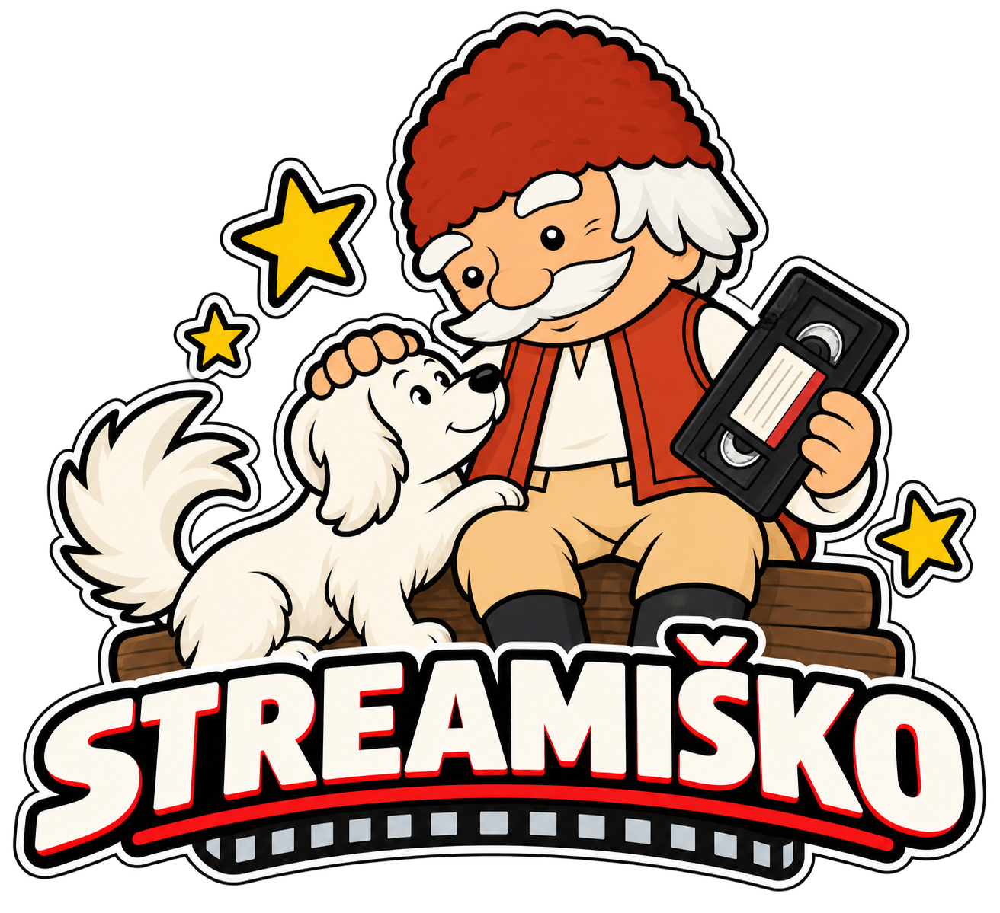

<p align="center">
  
</p>

# Streamiško

A Stremio addon designed for Vercel that searches SKTorrent results, checks TorBox cache availability, and exposes cached results as playable streams.

## Current behavior

Streamiško supports both **movies** and **series episodes** from Stremio/Cinemeta IMDb IDs.

For each request, the addon:

1. Resolves movie or series metadata from Cinemeta.
2. Searches `sktorrent.eu` across returned result pages.
3. Keeps the first Stremio stream as the **Hello Streamiško 👋** summary entry.
4. Shows TorBox API connection status in the Hello stream.
5. Authenticates to the SKTorrent download endpoint when credentials are configured and reads `.torrent` metadata.
6. Extracts torrent info hashes, filenames and, for series, the files inside each torrent.
7. Checks whether qualifying torrents are cached on TorBox.
8. Sorts results with cached torrents first, then uncached, then unknown; each group is sorted by size from largest to smallest.
9. For cached torrents, exposes a playable Stremio URL resolved lazily after the stream is clicked.

### Movies

Movie requests use the IMDb ID directly, for example `tt6723592`.

```text
Hello Streamiško 👋
Tenet (2020) • IMDb: tt6723592
Found torrents on sktorrent.eu: 27
TorBox: Connected ✅
```

### Series episode matching

Stremio requests a specific episode using an ID such as:

```text
tt0944947:2:5
```

Streamiško parses this as:

- IMDb ID: `tt0944947`
- season: `2`
- episode: `5`

The colon-separated ID is treated as a series episode rather than a movie.

The series discovery pipeline is:

```text
Stremio requests ttXXXX:S:E
        ↓
Parse IMDb ID + season + episode
        ↓
Resolve series metadata with Cinemeta
        ↓
Best-effort ČSFD lookup
        ↓
Build multiple SKTorrent search queries
        ↓
Search + merge + deduplicate
        ↓
Filter torrent titles by season
        ↓
Filter torrent titles by episode
        ↓
Keep plausible season / multi-season packs
        ↓
Download and inspect each candidate .torrent
        ↓
Find the exact requested episode file
        ↓
Extract infoHash + torrent file index
        ↓
Check TorBox cache and expose playback
```

For a request such as Season 2 Episode 5, search variants include forms like:

```text
Breaking Bad S02E05
Breaking Bad 2x05
Breaking Bad 2. série
Breaking Bad 2.série
Breaking Bad S02
Breaking Bad
```

The query builder also creates useful variants without diacritics and shortened-title variants. If a matching ČSFD URL can be resolved, the URL itself is tried as an SKTorrent search query before title-based queries.

#### Torrent-title filtering

Search results are treated only as discovery candidates. Streamiško locally validates their names before downloading torrent metadata.

Season matching understands patterns such as:

```text
S02
S02E05
2x05
Season 2
2. série
```

It also permits packs whose ranges contain the requested season, for example:

```text
S01-S05
Seasons 1-5
1.-5. série
Complete Series
```

Episode matching understands forms such as:

```text
S02E05
S02.E05
S02-E05
2x05
E05
05 Epizóda
05 Diel
05 Časť
```

Episode ranges such as `E01-E10`, `E01-10`, or `Episodes 1-10` are retained when they contain the requested episode. If a torrent title explicitly names a different episode and not the requested one, it is rejected as an episode mismatch.

A season pack such as `Breaking.Bad.S02.Complete.1080p` is intentionally allowed through the title stage even though its name contains no `E05`, because the requested episode can still be present inside the torrent.

#### Exact file selection

For every title-qualified candidate, Streamiško downloads the `.torrent` metadata and inspects its real file list.

For example, a season pack may contain:

```text
Breaking.Bad.S02E01.mkv
Breaking.Bad.S02E02.mkv
Breaking.Bad.S02E03.mkv
Breaking.Bad.S02E04.mkv
Breaking.Bad.S02E05.mkv
Breaking.Bad.S02E06.mkv
```

The file matcher recognizes `S02E05`, `2x05`, `02x05`, `E05`, `episode 5`, `05 Epizóda`, `05 Diel` and related path/folder forms. Files that explicitly belong to another season or episode are rejected.

A torrent is returned as a series result only after Streamiško finds the exact requested episode file. It remembers that file's zero-based torrent index and displays it in the stream information.

The resulting series stream therefore carries the equivalent of:

```text
infoHash + exact episode fileIdx
```

For TorBox playback, Streamiško passes that selected file index through its lazy playback route, re-validates the `.torrent` metadata, maps the same file in TorBox, and requests the direct URL for that episode rather than selecting the largest file in a season pack.

A series result now contains information similar to:

```text
Episode: S02E05
Torrent file: Breaking.Bad.S02.Complete.torrent
Episode file: Breaking.Bad.S02E05.mkv
File index: 4
Cached on TorBox: Yes ✅
```

## Torrent stream information

Torrent entries show:

- SKTorrent listing title
- requested episode marker for series results
- torrent filename
- exact episode file path and file index for series
- TorBox cache status (`Yes`, `No`, or `Unknown`)
- size
- seeders / leechers
- added date
- SKTorrent ID

When `Cached on TorBox: Yes ✅`, selecting the stream calls a server-side Streamiško play route. Streamiško re-checks the cache, finds or adds the cached torrent to the configured TorBox account with `add_only_if_cached=true`, requests the selected file's TorBox direct URL, and redirects Stremio to it.

Uncached or unknown-cache results remain non-playable and open the SKTorrent detail page instead.

## Endpoints

- `/manifest.json` — Stremio addon manifest for `movie` and `series`
- `/stream/movie/:id.json` — movie stream results
- `/stream/series/:videoId.json` — series episode results, e.g. `/stream/series/tt0944947:2:5.json`
- `/api/index?route=play&torrent=<SKTORRENT_ID>` — internal movie playback resolver
- `/api/series-v2?route=play&torrent=<SKTORRENT_ID>&season=<S>&episode=<E>&fileIdx=<INDEX>` — episode-aware TorBox playback resolver
- `/` — landing page

## Environment variables

Do **not** hardcode credentials or API keys in this repository. The repository is public, so committed secrets would be visible in the source and Git history.

```text
SKTORRENT_UID=your_sktorrent_uid
SKTORRENT_PASS=your_sktorrent_pass
TORBOX_API_KEY=your_torbox_api_key
```

A safe placeholder-only `.env.example` is included in the repository.

### SKTorrent credentials

`SKTORRENT_UID` and `SKTORRENT_PASS` are used server-side to send SKTorrent authentication cookies (`uid` and `pass`) to the torrent download endpoint.

### TorBox API key

`TORBOX_API_KEY` is used server-side to verify the account connection, check cache status, add only already-cached torrents when playback is requested, and request direct file URLs.

The API key is never included in the Stremio stream-list response and should only be stored as a private environment variable.

## Configure on Vercel

Add these private environment variables under **Settings → Environment Variables**:

```text
SKTORRENT_UID
SKTORRENT_PASS
TORBOX_API_KEY
```

Apply them to the environments you use and redeploy when their values change.

## Deploy to Vercel

1. Import this GitHub repository into Vercel.
2. Configure the three private environment variables above.
3. Deploy or redeploy.
4. Install the addon in Stremio using `https://YOUR-VERCEL-DOMAIN.vercel.app/manifest.json`.

## Local development

Create a local `.env` file (ignored by Git), then run:

```bash
npm install
npm run dev
```

Use `http://localhost:3000/manifest.json`.

## Planned direction

Later iterations can add caching for repeated Cinemeta, ČSFD, SKTorrent and TorBox lookups, plus more naming patterns for unusual localized releases.
